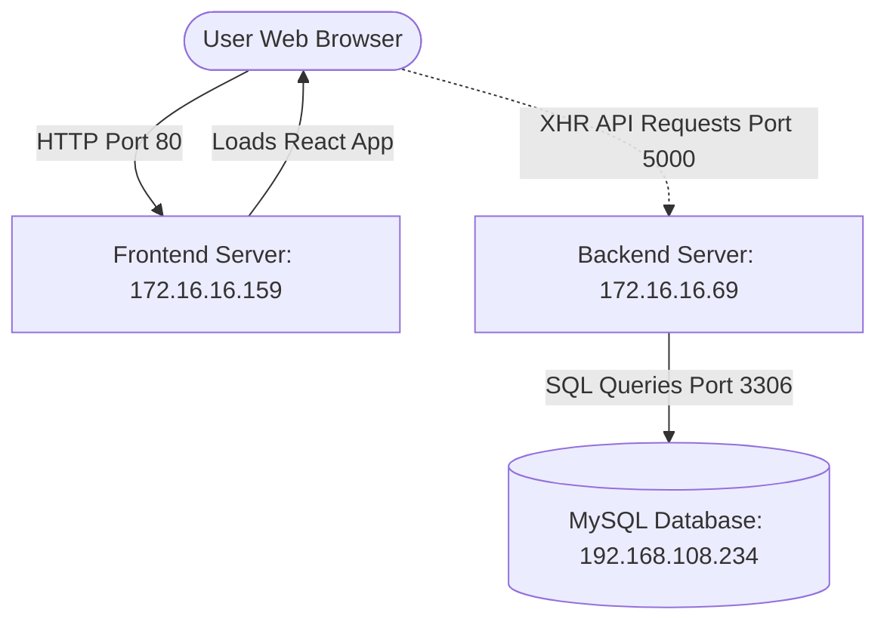

# Deployment Playbook: React + Express + MySQL Multi-Server Setup

This guide provides step-by-step instructions to deploy the Siv Dashboard application across three servers using **MobaXterm**.

---

## 🌐 Infrastructure Topology



| Component | Target IP Address | Software Stack | Port Configuration |
| :--- | :--- | :--- | :--- |
| **Database** | `192.168.108.234` | MySQL Server | Inbound: `3306` (Allow `172.16.16.69`) |
| **Backend API** | `172.16.16.69` | Node.js, Express, PM2 | Inbound: `5000` (Allow `172.16.16.159`) |
| **Frontend client** | `172.16.16.159` | Nginx, React (Static dist) | Inbound: `80` (Public) & `443` |
| **Domain Name** | `siv.com` | DNS A Record | Points to `172.16.16.159` |

---

## 🛠️ Step 1: Database Server Deployment (`192.168.108.234`)

### 1. SSH Connection in MobaXterm
1. Open MobaXterm.
2. Click **Session** -> **SSH**.
3. Set **Remote host** to `192.168.108.234` and username (e.g. `root` or admin user). Click **OK**.

### 2. Install MySQL Server (Ubuntu/Debian)
In the terminal session, execute:
```bash
sudo apt update
sudo apt install -y mysql-server
```

### 3. Configure Remote Network Access
By default, MySQL binds to `localhost` (`127.0.0.1`), blocking connection requests from the Backend Server.
1. Open the configuration file:
   ```bash
   sudo nano /etc/mysql/mysql.conf.d/mysqld.cnf
   ```
2. Find the line starting with `bind-address` and change it to `0.0.0.0` (listen on all interfaces):
   ```ini
   bind-address = 0.0.0.0
   ```
3. Save the file (Press `Ctrl+O`, then `Enter`, then exit nano with `Ctrl+X`).
4. Restart MySQL to apply configuration:
   ```bash
   sudo systemctl restart mysql
   sudo systemctl enable mysql
   ```

### 4. Setup Database and remote Access User
Log in to MySQL command-line utility:
```bash
sudo mysql -u root
```
Copy and paste the database creation instructions directly:
```sql
-- Create Database
CREATE DATABASE IF NOT EXISTS `siv_db` CHARACTER SET utf8mb4 COLLATE utf8mb4_unicode_ci;

-- Create User and Grant Remote Privileges to Backend Server (172.16.16.69)
CREATE USER IF NOT EXISTS 'siv_user'@'%' IDENTIFIED BY 'siv_password_2026';
GRANT ALL PRIVILEGES ON `siv_db`.* TO 'siv_user'@'%';
FLUSH PRIVILEGES;

-- Verify user creation
SELECT user, host FROM mysql.user;
EXIT;
```

### 5. Import the Schema
Using MobaXterm's built-in **SFTP Sidebar** (located on the left panel):
1. Navigate to `/tmp` in the SFTP panel.
2. Drag and drop the file `database/schema.sql` from your local computer into the SFTP file list.
3. Import the file inside the SSH terminal:
   ```bash
   mysql -u siv_user -p siv_db < /tmp/schema.sql
   # Enter password: siv_password_2026
   ```

### 6. Firewall Configuration
Ensure port `3306` is open for backend server requests:
```bash
sudo ufw allow from 172.16.16.69 to any port 3306 proto tcp
sudo ufw reload
```

---

## ⚙️ Step 2: Backend API Server Deployment (`172.16.16.69`)

### 1. SSH Connection in MobaXterm
1. Click **Session** -> **SSH**.
2. Set **Remote host** to `172.16.16.69` and click **OK**.

### 2. Install Node.js (LTS Version)
Run the NodeSource setup script to install Node.js v20:
```bash
sudo apt update
sudo apt install -y curl
curl -fsSL https://deb.nodesource.com/setup_20.x | sudo -E bash -
sudo apt install -y nodejs
node -v && npm -v
```

### 3. Install PM2 (Process Manager) globally
```bash
sudo npm install -y -g pm2
```

### 4. Upload Code via SFTP
1. In the SSH terminal, create the directory structure:
   ```bash
   sudo mkdir -p /var/www/siv/backend
   sudo chown -R $USER:$USER /var/www/siv/backend
   ```
2. In MobaXterm's **SFTP Sidebar**, navigate to `/var/www/siv/backend`.
3. Drag and drop the following files from your local workspace `backend/` folder into the SFTP pane:
   - `server.js`
   - `package.json`
   - `pm2-backend.config.js` (initially in `deployment/`)
   - `.env.example`

### 5. Configure environment properties
1. Rename the environment file or create one directly:
   ```bash
   nano /var/www/siv/backend/.env
   ```
2. Add the configuration matching your environment:
   ```env
   PORT=5000
   NODE_ENV=production
   DB_HOST=192.168.108.234
   DB_PORT=3306
   DB_USER=siv_user
   DB_PASSWORD=siv_password_2026
   DB_NAME=siv_db
   CORS_ORIGIN=http://172.16.16.159,http://siv.com
   ```
3. Save and close nano.

### 6. Install Dependencies and Launch App
```bash
cd /var/www/siv/backend
npm install --production

# Start Express Application with PM2 Cluster Config
pm2 start pm2-backend.config.js

# Ensure PM2 starts automatically on server reboots
pm2 save
pm2 startup
```
*(Copy and paste the `sudo env PATH=...` output command generated by `pm2 startup` into the terminal to complete boot registration).*

### 7. Firewall Configuration
Ensure port `5000` accepts connections from the frontend server:
```bash
sudo ufw allow from 172.16.16.159 to any port 5000 proto tcp
sudo ufw reload
```

---

## 🖥️ Step 3: Frontend Server Deployment (`172.16.16.159`)

### 1. Build the Frontend App Locally
Before uploading, you must build the client distribution assets on your local developer machine.
1. Open PowerShell or Command Prompt in the `frontend` folder.
2. Run:
   ```bash
   npm install
   npm run build
   ```
   *This compiles files into `frontend/dist`.*

### 2. Connect via MobaXterm SSH to Frontend Server
1. Click **Session** -> **SSH**.
2. Set **Remote host** to `172.16.16.159` and click **OK**.

### 3. Install Nginx
```bash
sudo apt update
sudo apt install -y nginx
sudo systemctl start nginx
sudo systemctl enable nginx
```

### 4. Upload Build Artifacts
1. Create directories:
   ```bash
   sudo mkdir -p /var/www/siv/frontend
   sudo chown -R $USER:$USER /var/www/siv/frontend
   ```
2. Navigate to `/var/www/siv/frontend` in MobaXterm's SFTP pane.
3. Drag and drop the **entire `dist` folder** (produced in your local `frontend/dist` directory) into `/var/www/siv/frontend`.
4. Confirm path is `/var/www/siv/frontend/dist` and contains `index.html` and the `assets/` directory.

### 5. Install Nginx Site Configuration
1. Open Nginx configuration panel:
   ```bash
   sudo nano /etc/nginx/sites-available/siv-frontend
   ```
2. Paste the following configuration (equivalent to `nginx-frontend.conf`):
   ```nginx
   server {
       listen 80;
       listen [::]:80;

       server_name siv.com www.siv.com 172.16.16.159;

       root /var/www/siv/frontend/dist;
       index index.html;

       location / {
           try_files $uri $uri/ /index.html;
       }

       # Logs
       access_log /var/log/nginx/siv-frontend-access.log;
       error_log /var/log/nginx/siv-frontend-error.log;
   }
   ```
3. Save and close.
4. Enable the site and disable default site:
   ```bash
   sudo ln -sf /etc/nginx/sites-available/siv-frontend /etc/nginx/sites-enabled/
   sudo rm -f /etc/nginx/sites-enabled/default
   ```
5. Test configuration and reload Nginx:
   ```bash
   sudo nginx -t
   sudo systemctl reload nginx
   ```

### 6. Firewall Configuration
Allow public HTTP and HTTPS traffic:
```bash
sudo ufw allow 'Nginx Full'
sudo ufw reload
```

---

## 🔗 Step 4: DNS Configuration (siv.com)

To resolve the domain `siv.com` to the frontend IP `172.16.16.159`:

### Production Setup (DNS Provider)
Create an **A Record** on your domain registrar control panel:
- Type: `A`
- Name/Host: `@` (or leave blank)
- Value/IP: `172.16.16.159`
- TTL: `Auto` (or `3600`)

Create a **CNAME Record** for subdomains:
- Type: `CNAME`
- Name/Host: `www`
- Value/Target: `siv.com`

### Local Testing Override (Hosts File)
If testing internally on Windows without real DNS setup, edit your local `hosts` file:
1. Open Notepad as **Administrator**.
2. Open file `C:\Windows\System32\drivers\etc\hosts`.
3. Add these lines:
   ```text
   172.16.16.159    siv.com
   172.16.16.159    www.siv.com
   ```
4. Save and restart browser. You can now access `http://siv.com` in your browser.

---

## 🔍 Verification Checklist
- [ ] Connect to `http://siv.com` or `http://172.16.16.159` - Verify the UI loads successfully.
- [ ] Click the **Refresh** button on the header - Verify it doesn't show connection error alerts (proving Frontend -> Backend connection is active).
- [ ] Click **Add Product** and submit a test SKU - Verify the item is written (proving Backend -> MySQL connection is active).
